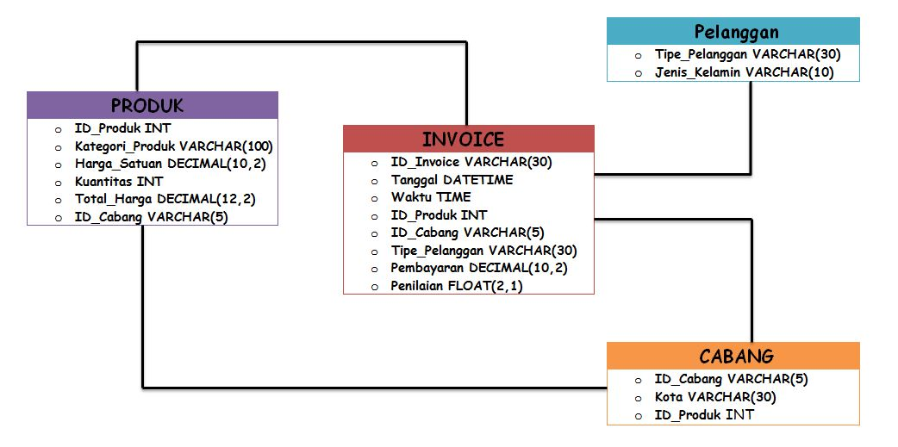
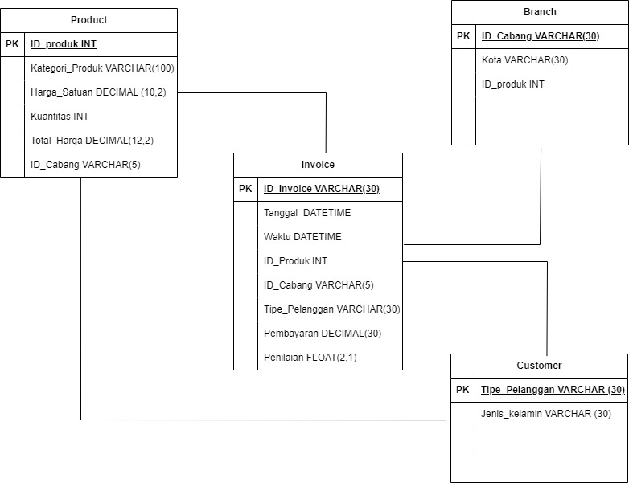

<p align="center">
  
</p>

<div align="center">

# Database Penjualan Supermarket Istana Langit

## INFO
**Database Penjualan Supermarket Istana Langit**

[Tentang](#scroll-tentang)
•
[Screenshot](#rice_scene-screenshot)
•
[Demo](#dvd-demo)
•
[Dokumentasi](#blue_book-dokumentasi)

</div>

## :bookmark_tabs: Menu

- [Tentang](#scroll-tentang)
- [Screenshot](#rice_scene-screenshot)
- [Demo](#dvd-demo)
- [Dokumentasi](#blue_book-dokumentasi)
- [Requirements](#exclamation-requirements)
- [Skema Database](#floppy_disk-skema-database)
- [ERD](#rotating_light-erd)
- [Deskripsi Data](#heavy_check_mark-deskripsi-data)
- [Struktur Folder](#open_file_folder-struktur-folder)
- [Tim Pengembang](#smiley_cat-tim-pengembang)

## :scroll: Tentang

Project akhir mata kuliah Manajemen Data Statistika mengambil topik tentang Penjualan Supermarket Istana Langit. Project ini mengspesifikasikan cabang dan produk berkinerja tinggi, menganalisis pola penjualan berbagai produk, dan memahami perilaku pelanggan. Kumpulan data yang digunakan dalam proyek ini bersumber dari Kaggle Walmart Sales Forecasting Competition. Hasil yang diharapkan adalah terbentuknya sebuah platform manajemen database berupa web application yang dapat memudahkan user dalam menganalisis untuk meningkatkan dan mengoptimalkan strategi penjualan.

## :rice_scene: Screenshot

<p align="center">
  
</p>

## :dvd: Demo

Berikut merupakan link untuk shinnyapps atau dashboard dari project kami:
https://akmarinak98.shinyapps.io/database_publikasi_statistika/

## :blue_book: Dokumentasi 

Dokumentasi penggunaan aplikasi database. Anda dapat juga membuat dokumentasi lives menggunakan readthedocs.org (opsional).

## :exclamation: Requirements

- Scrapping data menggunakan package R yaitu `rvest` dengan pendukung package lainnya seperti `tidyverse`,`rio`,`kableExtra` dan `stingr`  
- RDBMS yang digunakan adalah PostgreSQL dan ElephantSQL
- Dashboard menggunakan `shinny`, `shinnythemes`, `bs4Dash`, `DT`, dan `dplyr` dari package R

## :floppy_disk: Skema Database

Menggambarkan struktur *primary key* **produk**, **invoice**, **pelanggan** dan **cabang** dengan masing-masing *foreign key* dalam membangun relasi antara tabel atau entitas.
<p align="center">
  
</p>

## :rotating_light: ERD

  ERD (Entity Relationship Diagram) menampilkan hubungan antara entitas dengan atribut. Pada project ini, entitas invoice terdapat tiga atribut yang berhubungan dengan atribut pada entitas lain, yaitu Id_Produk berhubungan dengan entitas produk, Id_Cabang berhubungan dengan entitas cabang, Tipe_Pelanggan berhubungan dengan entitas pelanggan. Selain itu, entitas produk dan entitas cabang saling berhubungan pada atribut Id_Produk.


<p align="center">
  
</p>

## :heavy_check_mark: Deskripsi Data

Berisi tentang tabel-tabel yang digunakan berikut dengan sintaks SQL DDL (CREATE).

### Create Database
Databse Penjualan Supermarket Istana Langit menyimpan informasi yang mewakili atribut data yang saling berhubungan untuk kemudian dianalisis.
```sql
CREATE DATABASE data_penjualan
    WITH
    OWNER = postgres
    ENCODING = 'UTF8'
    CONNECTION LIMIT = -1
    IS_TEMPLATE = False;
```
### Create Table Produk
Table Produk memberikan informasi kepada user mengenai info produk yang ada di supermarket Istana Langit, sehingga user dapat mengetahui id produk, kategori produk, harga satuan dari produk tersebut, jumlah produk yang terjual, total penjualan produk tersebut dan id cabang dari produk tersebut. Berikut deskripsi untuk setiap tabel instansi.
| Attribute          | Type                  | Description                     |
|:-------------------|:----------------------|:--------------------------------|
| ID_Produk          | smallint              | Id Produk                       |
| Kategori_Produk    | character varying(100)| Kategori Produk                 |
| Harga_Satuan       | DECIMAL(10,2)         | Harga Satuan Produk             |
| Kuantitas          | smallint	             | Jumlah Penjulan Produk          |
| Total_Harga        | DECIMAL(12,2)		     | Total Harga Penjualan           |
| ID_Cabang          | character varying(5)  | ID Cabang                       |

dengan script SQL sebagai berikut:
```sql
CREATE TABLE IF NOT EXISTS public.produk (
    id_produk INT,
    kategori_produk varchar(100) NOT NULL,
    harga_satuan DECIMAL(10,2) NOT NULL,
	kuantitas int,
	total_harga DECIMAL(12,2) NOT NULL,
	id_cabang VARCHAR(5) NOT NULL,
    PRIMARY KEY (id_produk)
);
```
### Create Table Cabang
Table cabang memberikan informasi yang memudahkan user mengetahui tempat cabang dari penjualan suatu produk melalui id cabang, id produk dan kota asal cabang tersebut berada. Id cabang adalah kode yang digunakan untuk membedakan nama cabang yang sama pada tiap produk yang terjual. Berikut deskripsi untuk setiap tabel cabang.
| Attribute          | Type                  | Description                     |
|:-------------------|:----------------------|:--------------------------------|
| id_cabang          | character varying(5)  | Id Cabang                       |
| id_produk          | smallint              | Id Produk                       |
| kota               | character varying(30) | Kota Asal Cabang                |

dengan script SQL sebagai berikut:
```sql
CREATE TABLE IF NOT EXISTS public.cabang (
    id_cabang varchar(5) COLLATE pg_catalog."default" NOT NULL,
    id_produk INT COLLATE pg_catalog."default" NOT NULL,
    kota varchar(30),
    CONSTRAINT cabang_pkey PRIMARY KEY (id_cabang),
    CONSTRAINT departemen_id_instansi_fkey FOREIGN KEY (id_produk)
        REFERENCES public.produk (id_produk) MATCH SIMPLE
        ON UPDATE NO ACTION
        ON DELETE NO ACTION
);
```
### Create Table Invoice
Table invoice menyajikan informasi lengkap mengenai sebuah transaksi penjualan. Selain dapat mengetahui penjualan, user juga akan mendapatkan informasi tanggal dan waktu penjualan sebuah produk. Tipe pelanggan, produk yang terjual, cabang tempat transaksi terjadi, pembayaran hingga penilaian terhadap transaksi penjualan tersaji pada table ini. Lebih lanjut, informasi spesifik mengenai id invoice, id produk, id cabang dan tipe pelanggan dapat diketahui melalui table ini.  Berikut deskripsi untuk setiap tabel invoice.
| Attribute                  | Type                  | Description                     		             |
|:---------------------------|:----------------------|:------------------------------------------------|
| id_invoice                 | character varying(30) | Id Invoice                      		             |
| id_produk                  | smallint              | Id Produk                 		                   |
| id_cabang                  | character varying(5)  | Id Cabang                  		                 |	
| tipe_pelanggan             | character varying(30) | Tipe pelanggan                	                 |
| tanggal                    | datetime              | Tanggal Transaksi                               |
| waktu    	                 | time                  | Waktu Transaksi                                 |
| pembayaran                 | decimal(10,2)         | Jumlah Pembayaran    			                     |
| penilaian		               | float(2,1)            | Penilaian terhadap penjualan produk		         |

dengan script SQL sebagai berikut:              
```sql
CREATE TABLE IF NOT EXISTS public.judul (
    id_invoice varchar(30) COLLATE pg_catalog."default" NOT NULL,
    id_produk int COLLATE pg_catalog."default" NOT NULL,
    id_cabang varchar(5) COLLATE pg_catalog."default" NOT NULL, 
    tipe_pelanggan varchar(30) COLLATE pg_catalog."default" NOT NULL,  
    tanggal datetime,
    waktu time,
    pembayaran decimal(10,2) NOT NULL,
    penilaian float(2,1) NOT NULL,   
    CONSTRAINT invoice_pkey PRIMARY KEY (id_invoice),
    CONSTRAINT invoice_id_produk_fkey FOREIGN KEY (id_produk)
        REFERENCES public.produk (id_produk) MATCH SIMPLE
        ON UPDATE NO ACTION
        ON DELETE NO ACTION,
    CONSTRAINT invoice_id_cabang_fkey FOREIGN KEY (id_cabang)
        REFERENCES public.cabang (id_cabang) MATCH SIMPLE
        ON UPDATE NO ACTION
        ON DELETE NO ACTION,
    CONSTRAINT invoice_tipe_pelanggan_fkey FOREIGN KEY (tipe_pelanggan)
        REFERENCES public.pelanggan (tipe_pelanggan) MATCH SIMPLE
        ON UPDATE NO ACTION
        ON DELETE NO ACTION
    );
```
### Create Table Pelanggan
Table pelanggan memberikan informasi kepada user mengenai beberapa identitas pelanggan. User dapat mengetahui tipe pelanggan dan jenis kelamin pelanggan. Berikut deskripsi untuk setiap tabel penulis.
| Attribute                  | Type                  | Description                     		             |
|:---------------------------|:----------------------|:------------------------------------------------|
| tipe_pelanggan             | character varying(30) | Tipe Pelanggan                      		         |
| jenis_kelamin              | character varying(10) | Jenis Kelamin Pelanggan                  		   |


dengan script SQL sebagai berikut:
```sql
CREATE TABLE IF NOT EXISTS public.penulis (
    tipe_pelanggan varchar(30) COLLATE pg_catalog."default" NOT NULL,
    jenis_kelamin varchar(10) NOT NULL, 
    CONSTRAINT pelanggan_pkey PRIMARY KEY (tipe_pelanggan),
    CONSTRAINT pelanggan_tipe_pelanggan_fkey FOREIGN KEY (tipe_pelanggan)
        REFERENCES public.invoice (tipe_pelanggan) MATCH SIMPLE
        ON UPDATE NO ACTION
        ON DELETE NO ACTION,
);
```
## :open_file_folder: Struktur Folder

```
.
├── app           # ShinyApps
│   ├── css
│   │   ├── **/*.css
│   ├── server.R
│   └── ui.R
├── data 
│   ├── csv
│   │   ├── **/*.css
│   └── sql
|       └── db.sql
├── src           # Project source code
├── doc           # Doc for the project
├── .gitignore
├── LICENSE
└── README.md
```

## :smiley_cat: Tim Pengembang
+ Database Manager : [Nabila Tri Amanda](https://github.com/nbltriamanda) (G1501231068)
+ Frontend Developer : [Erdanisa Aghnia Ilmani](https://github.com/) (G1501231032)
+ Backend Developer : [Fajar Athallah Yusuf](https://github.com/) (G1501231038)
+ Technical Writer : [Anwar Fajar Rizki](https://github.com/) (G1501231003)
 

 
